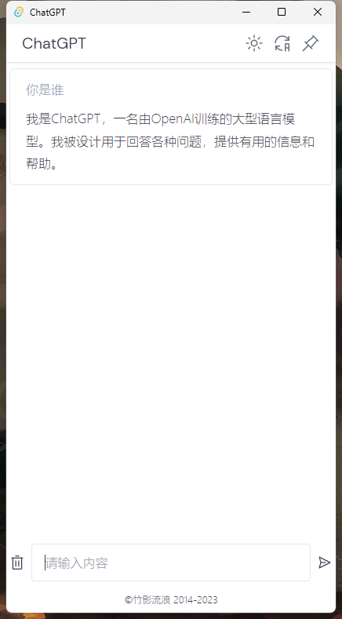

# 说明
需要配套 https://github.com/Curtion/chatgpt-api 使用

修改`.env`后端地址

## 浏览器端

1. npm install
2. npm run dev # 开发环境
3. npm run build # 生产构建

最终`dist`目录下的文件可以直接部署到服务器。

## 应用端

1. npm install
2. npm run tauri:dev # 开发环境
3. npm run tauri:build # 生产构建

最终`./src-tauri/target/release/bundle`目录下的文件为可执行文件。

# 截图

